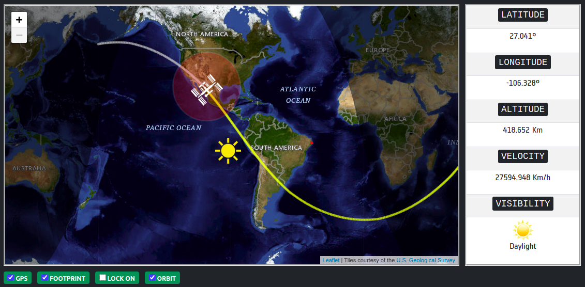

# ISS Tracker - Rastreador da Estação Espacial Internacional 

Rastreador que mostra em tempo real a localização da `EEI - Estação Espacial Internacional` (em inglês: `ISS - International Space Station`), calcula sua órbita futura, superfície visível e a localização GPS(Global Positioning System) do obervador na terra.

A ISS é uma `estação espacial modular habitável` que tem como propósito ser um moderno laboratório, encontra-se em órbita da Terra a uma altitude de aproximadamente 400km, uma órbita tipicamente designada de órbita terrestre baixa.

#### Músicas que me inspiraram durante o desenvolvimento do projeto:

[Chris Hadfield - Space Oddity](https://www.youtube.com/watch?v=KaOC9danxNo)

[Chris Hadfield and Barenaked Ladies - I.S.S. (Is Somebody Singing)](https://www.youtube.com/watch?v=AvAnfi8WpVE)

[David Bowie – Starman](https://www.youtube.com/watch?v=aBKEt3MhNMM)

[Hans Zimmer - Interstellar Main Theme](https://www.youtube.com/watch?v=kpz8lpoLvrA)

[Linkin Park - Leave Out All The Rest](https://www.youtube.com/watch?v=yZIummTz9mM)

[John Murphy - The Surface Of The Sun (Sunshine)](https://www.youtube.com/watch?v=-YghewnxhiQ)

[Chris Hadfield - Beyond the Terra](https://www.youtube.com/watch?v=z8Qphhh7YAY)

[Nenhum de Nós - O Astronauta de Mármore](https://www.youtube.com/watch?v=auAGPN_keDs)

[Linkin Park - Leave Out All The Rest - Shadow of The Day - Iridescent](https://www.youtube.com/watch?v=rXMlLEvzGZU)

[David Bowie – Space Oddity](https://www.youtube.com/watch?v=iYYRH4apXDo)

